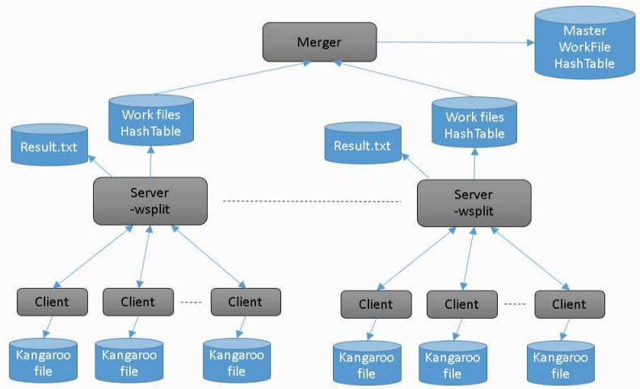
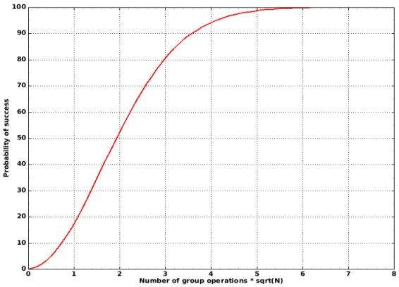
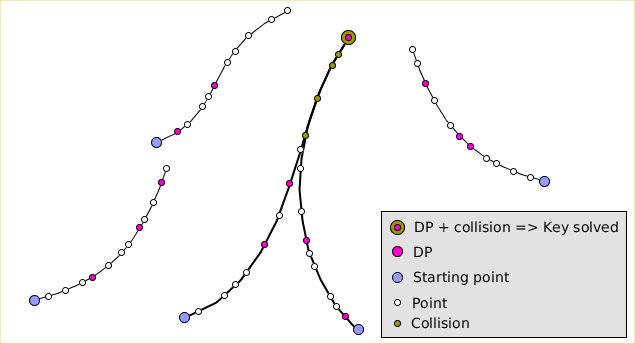

# Pollard's kangaroo for SECPK1

A Pollard's kangaroo interval ECDLP solver for SECP256K1 (based on VanitySearch engine).\
**This program is limited to a 125bit interval search.**

# Feature

<ul>
  <li>Fixed size arithmetic</li>
  <li>Fast Modular Inversion (Delayed Right Shift 62 bits)</li>
  <li>SecpK1 Fast modular multiplication (2 steps folding 512bits to 256bits reduction using 64 bits digits)</li>
  <li>Multi-GPU support</li>
  <li>CUDA optimisation via inline PTX assembly</li>
</ul>

# Discussion Thread

Discusion thread: https://bitcointalk.org/index.php?topic=5244940.0

# Usage

```
Kangaroo v2.1
Kangaroo [-v] [-t nbThread] [-d dpBit] [gpu] [-check]
         [-gpuId gpuId1[,gpuId2,...]] [-g g1x,g1y[,g2x,g2y,...]]
         inFile
 -v: Print version
 -gpu: Enable gpu calculation
 -gpuId gpuId1,gpuId2,...: List of GPU(s) to use, default is 0
 -g g1x,g1y,g2x,g2y,...: Specify GPU(s) kernel gridsize, default is 2*(MP),2*(Core/MP)
 -d: Specify number of leading zeros for the DP method (default is auto)
 -t nbThread: Secify number of thread
 -w workfile: Specify file to save work into (current processed key only)
 -i workfile: Specify file to load work from (current processed key only)
 -wi workInterval: Periodic interval (in seconds) for saving work
 -ws: Save kangaroos in the work file
 -wss: Save kangaroos via the server
 -wsplit: Split work file of server and reset hashtable
 -wm file1 file2 destfile: Merge work file
 -wmdir dir destfile: Merge directory of work files
 -wt timeout: Save work timeout in millisec (default is 3000ms)
 -winfo file1: Work file info file
 -wpartcreate name: Create empty partitioned work file (name is a directory)
 -wcheck worfile: Check workfile integrity
 -m maxStep: number of operations before give up the search (maxStep*expected operation)
 -s: Start in server mode
 -c server_ip: Start in client mode and connect to server server_ip
 -sp port: Server port, default is 17403
 -nt timeout: Network timeout in millisec (default is 3000ms)
 -o fileName: output result to fileName
 -l: List cuda enabled devices
 -check: Check GPU kernel vs CPU
 inFile: intput configuration file
```

Structure of the input file:
* All values are in hex format
* Public keys can be given either in compressed or uncompressed format

```
Start range
End range
Key #1
Key #2
...
```

ex

```
49dccfd96dc5df56487436f5a1b18c4f5d34f65ddb48cb5e0000000000000000
49dccfd96dc5df56487436f5a1b18c4f5d34f65ddb48cb5effffffffffffffff
0459A3BFDAD718C9D3FAC7C187F1139F0815AC5D923910D516E186AFDA28B221DC994327554CED887AAE5D211A2407CDD025CFC3779ECB9C9D7F2F1A1DDF3E9FF8
0335BB25364370D4DD14A9FC2B406D398C4B53C85BE58FCC7297BD34004602EBEC
```

# Note on Time/Memory tradeoff of the DP method

The distinguished point (DP) method is an efficient method for storing random walks and detect collision between them. Instead of storing all points of all kangagroo's random walks, we store only points that have an x value starting with dpBit zero bits. When 2 kangaroos collide, they will then follow the same path because their jumps are a function of their x values. The collision will be then detected when the 2 kangaroos reach a distinguished point.\
This has a drawback when you have a lot of kangaroos and looking for collision in a small range as the overhead is in the order of nbKangaroo.2<sup>dpBit</sup> until a collision is detected. If dpBit is too small a large number of point will enter in the central table, will decrease performance and quickly fill the RAM.
**Powerfull GPUs with large number of cores won't be very efficient on small range, you can try to decrease the grid size in order to have less kangaroos but the GPU performance may not be optimal.**
Yau can change manualy the DP mask size using the -d option, take in consideration that it will require more operations to complete. See table below:

| nbKangaroo.2<sup>dpBit</sup>/sqrt(N) |  DP Overhead | Avg | 
|--------------------------------------|:------------:|:---:|
| 4.000 | cubicroot(1+4.000) = ~71.0% | 3.55 sqrt(N) |
| 2.000 | cubicroot(1+2.000) = ~44.2% | 2.99 sqrt(N) |
| 1.000 | cubicroot(1+1.000) = ~26.0% | 2.62 sqrt(N) |
| 0.500 | cubicroot(1+0.500) = ~14.5% | 2.38 sqrt(N) |
| 0.250 | cubicroot(1+0.250) = ~7.7% | 2.24 sqrt(N) |
| 0.125 | cubicroot(1+0.125) = ~4.0% | 2.16 sqrt(N) |

DP overhead according to the range size (N), DP mask size (dpBit) and number of kangaroos running in paralell (nbKangaroo).

Note that restarting a client without having a kangaroo backup is like adding more kangaroos, when you merge workfiles coming from different kangaroos, it is also like having more kangaroos.

# How to deal with work files

You can save periodicaly work files using -w -wi -ws options. When you save a work file, if it does not contain the kangaroos (-ws) you will lost a bit of work due to the DP overhead, so if you want to continue a file on a same configuration it is recommended to use -ws. To restart a work, use the -i option, the input ascii file is not needed.\
When you continue a work file on a different hardware, or using a different number of bits for the distinguished points, or a different number of kangaroos, you will also get an overhead.\
However, work files are compatible (same key and range) and can be merged, if 2 work files have a different number of distinguished bits, the lowest will be recorded in the destination file.\
If you have several hosts with different configurations, it is preferable to use -ws on each host and then merge all files from time to time in order to check if the key can be solved. When a merge solve a key, no output file is written. A merged file does not contain kangaroos.

Start a work from scratch and save work file every 30 seconds:
```
Kangaroo.exe -ws -w save.work -wi 30 in.txt
```

Continue the work from save.work and save work file every 30 seconds:
```
Kangaroo.exe -ws -w save.work -wi 30 -i save.work
```

Getting info from a work file:
```
Kangaroo.exe -winfo save.work
Kangaroo v1.5
Loading: save.work
Version   : 0
DP bits   : 16
Start     : 3447F65ABC9F46F736A95F87B044829C8A0129D56782D635CD00000000000000
Stop      : 3447F65ABC9F46F736A95F87B044829C8A0129D56782D635CDFFFFFFFFFFFFFF
Key       : 031D91282433E664132046D25189A5FE0F64645A73494A37AB17BD6FB283AE5BA2
Count     : 808510464 2^29.591
Time      : 01:35
DP Size   : 2.4/5.8MB
DP Count  : 12199 2^13.574
HT Max    : 3 [@ 008A9F]
HT Min    : 0 [@ 000000]
HT Avg    : 0.05
HT SDev   : 0.22
Kangaroos : 4096 2^12.000
```

Merge 2 work files (here the key has been solved during the merge):
```
Kangaroo.exe -wm save1.work save2.work save3.work
Kangaroo v1.5
Loading: save1.work
MergeWork: [HashTable1 2.3/5.3MB] [00s]
Loading: save2.work
MergeWork: [HashTable2 2.3/5.3MB] [00s]
Merging...
Range width: 2^56

Key# 0 [1S]Pub:  0x031D91282433E664132046D25189A5FE0F64645A73494A37AB17BD6FB283AE5BA2
       Priv: 0x3447F65ABC9F46F736A95F87B044829C8A0129D56782D635CD612C0F05F3DA03
Dead kangaroo: 0
Total f1+f2: count 2^30.04 [02:17]
```

Note on the wsplit option:

In order to avoid to handle a big hashtable in RAM, it is possible to save it and reset it at each backup. It will save a work file with a prefix at each backup and reset the hashtable in RAM. Then a merge can be done offline and key solved by merge. Even with a small hashtable, the program may also solve the key as paths continue and collision may occur in the small hashtable so don't forget to use -o option when using server(s). 

Exemple with a 64bit key:
```
Kangaroo.exe -d 10 -s -w save.work -wsplit -wi 10 ..\VC_CUDA8\in64.txt
```

```
Kangaroo v1.6
Start:5B3F38AF935A3640D158E871CE6E9666DB862636383386EE0000000000000000
Stop :5B3F38AF935A3640D158E871CE6E9666DB862636383386EEFFFFFFFFFFFFFFFF
Keys :1
Range width: 2^64
Expected operations: 2^33.05
Expected RAM: 344.2MB
DP size: 10 [0xFFC0000000000000]
Kangaroo server is ready and listening to TCP port 17403 ...
[Client 0][Kang 2^-inf][DP Count 2^-inf/2^23.05][Dead 0][04s][2.0/4.0MB]
New connection from 127.0.0.1:58358
[Client 1][Kang 2^18.58][DP Count 2^-inf/2^23.05][Dead 0][08s][2.0/4.0MB]
New connection from 172.24.9.18:52090
[Client 2][Kang 2^18.61][DP Count 2^16.17/2^23.05][Dead 0][10s][4.2/14.1MB]
SaveWork: save.work_27May20_063455...............done [4.2 MB] [00s] Wed May 27 06:34:55 2020
[Client 2][Kang 2^18.61][DP Count 2^20.25/2^23.05][Dead 0][20s][40.1/73.9MB]
SaveWork: save.work_27May20_063505...............done [40.1 MB] [00s] Wed May 27 06:35:06 2020
[Client 2][Kang 2^18.61][DP Count 2^20.17/2^23.05][Dead 0][30s][37.9/71.5MB]
SaveWork: save.work_27May20_063516...............done [37.9 MB] [00s] Wed May 27 06:35:16 2020
[Client 2][Kang 2^18.61][DP Count 2^20.55/2^23.05][Dead 0][41s][48.9/82.8MB]
SaveWork: save.work_27May20_063526...............done [48.9 MB] [00s] Wed May 27 06:35:27 2020
[Client 2][Kang 2^18.61][DP Count 2^20.29/2^23.05][Dead 0][51s][41.1/74.9MB]
SaveWork: save.work_27May20_063537...............done [41.1 MB] [00s] Wed May 27 06:35:37 2020
[Client 2][Kang 2^18.61][DP Count 2^20.30/2^23.05][Dead 0][01:02][41.5/75.2MB]
SaveWork: save.work_27May20_063547...............done [41.5 MB] [00s] Wed May 27 06:35:48 2020
[Client 2][Kang 2^18.61][DP Count 2^20.28/2^23.05][Dead 0][01:12][40.9/74.6MB]
SaveWork: save.work_27May20_063558...............done [40.9 MB] [00s] Wed May 27 06:35:58 2020 <= offline merge solved the key there
[Client 2][Kang 2^18.61][DP Count 2^20.19/2^23.05][Dead 0][01:22][38.5/72.2MB]
SaveWork: save.work_27May20_063608...............done [38.5 MB] [00s] Wed May 27 06:36:08 2020
[Client 2][Kang 2^18.61][DP Count 2^20.55/2^23.05][Dead 0][01:33][48.8/82.7MB]
SaveWork: save.work_27May20_063618...............done [48.8 MB] [00s] Wed May 27 06:36:19 2020
[Client 2][Kang 2^18.61][DP Count 2^19.98/2^23.05][Dead 0][01:41][33.5/66.8MB]
Key# 0 [1S]Pub:  0x03BB113592002132E6EF387C3AEBC04667670D4CD40B2103C7D0EE4969E9FF56E4
       Priv: 0x5B3F38AF935A3640D158E871CE6E9666DB862636383386EE510F18CCC3BD72EB
```

Note on -wss option:

The wss option allow to use the server to make kangaroo backups, the client send kangaroo (in compressed format) to the server. When a client restart with -wss option, it tries to download the backup. If the specified file is not found by the server, the client creates new kangaroos. There is no need to use -i option here. Make sure when restarting a new job with a different range or key, that the client does not download an old backup. Make sure that when a backup is downloaded, that no kangaroos are created or not handled by the client. This option is usefull if you cannot rely on client side to handle kangaoo backup.

Send kangaroo to the server every 20 second and, when starting, try to download kang.
```
./kangaroo -w kang -wss -wi 20 -c pcjlpons
```

# Distributed clients and central server(s)

It is possible to run Kangaroo in client/server mode. The server has the same options as the standard program except that you have to specify manually the number of distinguished point bits number using -d. All clients which connect will get back the configuration from the server. At the moment, the server is limited to one single key. If you restart the server with a different configuration (range or key), you need to stop all clients otherwise they will reconnect and send wrong points.

Starting the server with backup every 5 min, 12 distinguished bits, in64.txt as config file:

```
pons@linpons:~/Kangaroo$./kangaroo -w save.work -wi 300 -o result.txt -s -d 12 in64.txt
```
**Warning**: The server is very simple and has no authentication mechanism, so if you want to export it on the net, use at your own risk.

Starting client, using gpu and connect to the server linpons, backup kangaroos every 10min:
```
Kangaroo.exe -t 0 -gpu -w kang.work -wi 600 -c linpons
```



**What to do in case of a server crash:**\
When the server is stopped, clients wait for reconnection, so simply restart it, no need to reload a backup if using wsplit (recommended).\
**What to do in case of a client crash:**\
Retart the client using the last kangaroos backup:
```
Kangaroo.exe -t 0 -gpu -i kang.work -w kang.work -wi 600 -c linpons
```
When the client restart from backup, it will produce duplicate points (counted as dead kangaroos) until it reaches its progress before the crash. It is important to restart the client with its backup, otherwise new kangaroos are created and the DP overhead increases.

To build such an architecture, the total number of kangaroo running in parallel must be know at the starting time to estimate the DP overhead. **It is not recommended to add or remove clients during running time**, the number of kangaroo must be constant.

This program solved puzzle #110 in 2.1 days (109 bit key on the Secp256K1 field) using this architecture on 256 Tesla V100. It required 2<sup>55.55</sup> group operations using DP25 to complete.
This program also solved #115 in 13 days (114 bit key on the Secp256K1 field). It required 2<sup>58.36</sup> group operations using DP25 to complete.

# Probability of success

The picture below show the probability of success after a certain number of group operations. N is range size.
This plot does not take into consideration the DP overhead.




# How it works

The program uses 2 herds of kangaroos, a tame herd and a wild herd. When 2 kangoroos (a wild one and a tame one) collide, the 
key can be solved. Due to the birthday paradox, a collision happens (in average) after 2.08*sqrt(k2-k1) [1] group operations, the 2 herds have the same size. To detect collision, the distinguished points method is used with a hashtable.

Here is a brief description of the algorithm:

We have to solve P = k.G, P is the public key, we know that k lies in the range [k1,k2], G is the SecpK1 generator point.\
Group operations are additions on the elliptic curve, scalar operations are done modulo the order of the curve.

n = floor(log2(sqrt(k2-k1)))+1

* Create a jump point table jP = [G,2G,4G,8G,...,2<sup>n-1</sup>.G]
* Create a jump distance table jD = [1,2,4,8,....,2<sup>n-1</sup>]
 
for all i in herdSize</br>
&nbsp;&nbsp;tame<sub>i</sub> = rand(0..(k2-k1)) <em># Scalar operation</em></br>
&nbsp;&nbsp;tamePos<sub>i</sub> = (k1+tame<sub>i</sub>).G <em># Group operation</em></br>
&nbsp;&nbsp;wild<sub>i</sub> = rand(0..(k2-k1)) - (k2-k1)/2 <em># Scalar operation</em></br>
&nbsp;&nbsp;wildPos<sub>i</sub> = P + wild<sub>i</sub>.G <em># Group operation</em></br>

found = false</br>

while not found</br>
&nbsp;&nbsp;for all i in herdSize</br>
&nbsp;&nbsp;&nbsp;&nbsp;  tamePos<sub>i</sub> = tamePos<sub>i</sub> + jP[tamePos<sub>i</sub>.x % n] <em># Group operation</em></br>
&nbsp;&nbsp;&nbsp;&nbsp;  tame<sub>i</sub> += jD[tamePos<sub>i</sub>.x % n] <em># Scalar operation</em></br>
&nbsp;&nbsp;&nbsp;&nbsp;  wildPos<sub>i</sub> = wildPos<sub>i</sub> + jP[wildPos<sub>i</sub>.x % n] <em># Group operation</em></br>
&nbsp;&nbsp;&nbsp;&nbsp;  wild<sub>i</sub> += jD[wildPos<sub>i</sub>.x % n] <em># Scalar operation</em></br>
&nbsp;&nbsp;&nbsp;&nbsp;  if tamePos<sub>i</sub> is distinguished</br>
&nbsp;&nbsp;&nbsp;&nbsp;&nbsp;&nbsp;  add (TAME,tamePos<sub>i</sub>,tame<sub>i</sub>) to hashTable</br>
&nbsp;&nbsp;&nbsp;&nbsp;  if wildPos<sub>i</sub> is distinguished</br>
&nbsp;&nbsp;&nbsp;&nbsp;&nbsp;&nbsp;  add (WILD,wildPos<sub>i</sub>,wild<sub>i</sub>) to hashTable</br>
&nbsp;&nbsp;found = is there a collision in hashTable between a tame and a wild kangaroo ?</br>
</br>

(Tame,Wild) = Collision</br>
k = k1 + Tame.dist - Wild.dist</br>


Here is an illustration of what's happening. When 2 paths collide they form a shape similar to the lambda letter. This is why this method is also called lambda method.



# Compilation

## Windows

Install CUDA SDK 10.2 and open VC_CUDA102\Kangaroo.sln in Visual C++ 2019.\
You may need to reset your *Windows SDK version* in project properties.\
In Build->Configuration Manager, select the *Release* configuration.\
Build and enjoy.\
\
Note: The current release has been compiled with Visual studio 2019 and CUDA SDK 10.2, if you have a different release of the CUDA SDK, you may need to update CUDA SDK paths in Kangaroo.vcxproj using a text editor. The current nvcc option are set up to architecture starting at 3.0 capability, for older hardware, add the desired compute capabilities to the list in GPUEngine.cu properties, CUDA C/C++, Device, Code Generation.

Visual Studio 2015 + Cuda 8 => Take project files in VC_CUDA8\
Visual Sutido 2017 + Cuda 10 => Take project files in VC_CUDA10 (project files might be out of date)\
Visual Studio 2019 + Cuda10.2 => Take project files in VC_CUDA102\

## Linux

Install CUDA SDK.\
Depending on the CUDA SDK version and on your Linux distribution you may need to install an older g++ (just for the CUDA SDK).\
Edit the makefile and set up the good CUDA SDK path and appropriate compiler for nvcc. 

```
CUDA       = /usr/local/cuda-8.0
CXXCUDA    = /usr/bin/g++-4.8
```

You can enter a list of architecture (refer to nvcc documentation) if you have several GPU with different architecture. Compute capability 2.0 (Fermi) is deprecated for recent CUDA SDK.
Kangaroo need to be compiled and linked with a recent gcc (>=7). The current release has been compiled with gcc 7.3.0.\
Go to the Kangaroo directory. ccap is the desired compute capability.

```
$ g++ -v
gcc version 7.3.0 (Ubuntu 7.3.0-27ubuntu1~18.04)
$ make all (for build without CUDA support)
or
$ make gpu=1 ccap=20 all
```
Runnig Kangaroo (Intel(R) Xeon(R) CPU, 8 cores,  @ 2.93GHz, Quadro 600 (x2))

```
$pons@linpons:~/Kangaroo$cat in.txt 
0
FFFFFFFFFFFFFF
02E9F43F810784FF1E91D8BC7C4FF06BFEE935DA71D7350734C3472FE305FEF82A
pons@linpons:~/Kangaroo$export LD_LIBRARY_PATH=/usr/local/cuda-8.0/lib64
pons@linpons:~/Kangaroo$./kangaroo -t 4 -gpu -gpuId 0,1 in.txt 
Kangaroo v1.2
Start:0
Stop :FFFFFFFFFFFFFF
Keys :1
Number of CPU thread: 4
Range width: 2^56
Number of random walk: 2^16.64 (Max DP=9)
DP size: 9 [0xff80000000000000]
SolveKeyCPU Thread 0: 1024 kangaroos
SolveKeyCPU Thread 2: 1024 kangaroos
SolveKeyCPU Thread 1: 1024 kangaroos
SolveKeyCPU Thread 3: 1024 kangaroos
GPU: GPU #0 Quadro 600 (2x48 cores) Grid(4x96) (13.5 MB used)
SolveKeyGPU Thread GPU#0: creating kangaroos...
GPU: GPU #1 Quadro 600 (2x48 cores) Grid(4x96) (13.5 MB used)
SolveKeyGPU Thread GPU#1: creating kangaroos...
SolveKeyGPU Thread GPU#0: 2^15.58 kangaroos in 334.8ms
SolveKeyGPU Thread GPU#1: 2^15.58 kangaroos in 364.7ms
[22.67 MKey/s][GPU 13.04 MKey/s][Count 2^29.06][Dead 0][28s][89.1MB]  
Key# 0 Pub:  0x02E9F43F810784FF1E91D8BC7C4FF06BFEE935DA71D7350734C3472FE305FEF82A 
       Priv: 0x378ABDEC51BC5D 

Done: Total time 29s 
```

# Example of usage

Puzzle [32BTC](https://www.blockchain.com/btc/tx/08389f34c98c606322740c0be6a7125d9860bb8d5cb182c02f98461e5fa6cd15), every 5 addresses, the public key is exposed and can be attacked with Kangaroo ECDLP solver.


Puzzle #85: 84bits private key [2<sup>84</sup>,2<sup>85</sup>-1], [1Kh22PvXERd2xpTQk3ur6pPEqFeckCJfAr](https://www.blockchain.com/btc/address/1Kh22PvXERd2xpTQk3ur6pPEqFeckCJfAr)

```
1000000000000000000000
1FFFFFFFFFFFFFFFFFFFFF
0329c4574a4fd8c810b7e42a4b398882b381bcd85e40c6883712912d167c83e73a
```

On an Xeon E5-2690 V4 with 4xTesla V100 (GPU only):

```
Kangaroo v2.1
Start:1000000000000000000000
Stop :1FFFFFFFFFFFFFFFFFFFFF
Keys :1
Number of CPU thread: 0
Range width: 2^84
Jump Avg distance: 2^42.03
Number of kangaroos: 2^23.32
Suggested DP: 16
Expected operations: 2^43.12
Expected RAM: 6347.6MB
DP size: 16 [0xFFFF000000000000]
GPU: GPU #1 Tesla V100-PCIE-16GB (80x64 cores) Grid(160x128) (207.0 MB used)
SolveKeyGPU Thread GPU#1: creating kangaroos...
GPU: GPU #2 Tesla V100-PCIE-16GB (80x64 cores) Grid(160x128) (207.0 MB used)
SolveKeyGPU Thread GPU#2: creating kangaroos...
GPU: GPU #0 Tesla V100-PCIE-16GB (80x64 cores) Grid(160x128) (207.0 MB used)
SolveKeyGPU Thread GPU#0: creating kangaroos...
GPU: GPU #3 Tesla V100-PCIE-16GB (80x64 cores) Grid(160x128) (207.0 MB used)
SolveKeyGPU Thread GPU#3: creating kangaroos...
SolveKeyGPU Thread GPU#1: 2^21.32 kangaroos [12.3s]
SolveKeyGPU Thread GPU#2: 2^21.32 kangaroos [12.3s]
SolveKeyGPU Thread GPU#3: 2^21.32 kangaroos [12.3s]
SolveKeyGPU Thread GPU#0: 2^21.32 kangaroos [12.4s]
[7828.45 MK/s][GPU 7828.45 MK/s][Count 2^43.22][Dead 2][24:56 (Avg 20:24)][4.8/6.9GB]
Key# 0 [1S]Pub:  0x0329C4574A4FD8C810B7E42A4B398882B381BCD85E40C6883712912D167C83E73A
       Priv: 0x11720C4F018D51B8CEBBA8
```

Next puzzles to solve:

#110, 109bits private key [2<sup>109</sup>,2<sup>110</sup>-1], [12JzYkkN76xkwvcPT6AWKZtGX6w2LAgsJg](https://www.blockchain.com/btc/address/12JzYkkN76xkwvcPT6AWKZtGX6w2LAgsJg) **1.10BTC** **Solved by this program**

```
2000000000000000000000000000
3FFFFFFFFFFFFFFFFFFFFFFFFFFF
0309976BA5570966BF889196B7FDF5A0F9A1E9AB340556EC29F8BB60599616167D
```

#115, 114bits private key [2<sup>114</sup>,2<sup>115</sup>-1], [1NLbHuJebVwUZ1XqDjsAyfTRUPwDQbemfv](https://www.blockchain.com/btc/address/1NLbHuJebVwUZ1XqDjsAyfTRUPwDQbemfv) **1.15BTC** **Solved by this program**

```
40000000000000000000000000000
7FFFFFFFFFFFFFFFFFFFFFFFFFFFF
0248D313B0398D4923CDCA73B8CFA6532B91B96703902FC8B32FD438A3B7CD7F55
```

#120, 119bits private key [2<sup>119</sup>,2<sup>120</sup>-1], [17s2b9ksz5y7abUm92cHwG8jEPCzK3dLnT](https://www.blockchain.com/btc/address/17s2b9ksz5y7abUm92cHwG8jEPCzK3dLnT) **1.20BTC**

```
800000000000000000000000000000
FFFFFFFFFFFFFFFFFFFFFFFFFFFFFF
02CEB6CBBCDBDF5EF7150682150F4CE2C6F4807B349827DCDBDD1F2EFA885A2630
```

Expected time: ~2 months on 256 Tesla V100.

[Up to #160](https://raw.githubusercontent.com/JeanLucPons/Kangaroo/master/puzzle32.txt)

# Articles

 - [1] Using Equivalence Classes to Accelerate Solvingthe Discrete Logarithm Problem in a Short Interval\
       https://www.iacr.org/archive/pkc2010/60560372/60560372.pdf
 - [2] Kangaroo Methods for Solving theInterval Discrete Logarithm Problem\
       https://arxiv.org/pdf/1501.07019.pdf
 - [3] Factoring and Discrete Logarithms using Pseudorandom Walks\
       https://www.math.auckland.ac.nz/~sgal018/crypto-book/ch14.pdf
 - [4] Kangaroos, Monopoly and Discrete Logarithms\
       https://web.northeastern.edu/seigen/11Magic/KruskalsCount/PollardKangarooMonopoly.pdf
